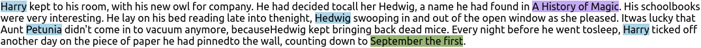
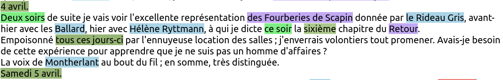
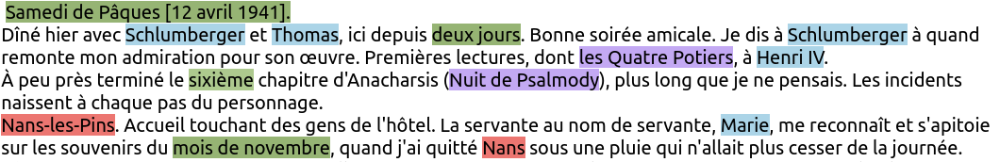

# deepPavlov-NER
Python deepPavlov wrapper for NER.
Able to get Named Entities using BERT language models in 100+ languages as well as 17 different types of named entities (CARDINAL, DATE, EVENT, FAC, GPE, LANGUAGE, LAW, LOC, MONEY, NORP, ORDINAL, ORG, PERSON, PRODUCT, QUANTITY, TIME, WORK_OF_ART)

# Examples

## English examples
Dummy test on _Harry Potter 1_

...



## French examples
Dummy test on _Journal de Jean Lambert_\
Jean Aristide Lambert (1914 - 1999) was a Germanist and French writer.



...



For full examples see:
http://people.irisa.fr/Guillaume.Le_Noe-Bienvenu/results/deepPavlov_ner_ontonotes_bert_mult_Journal_Jean_Lambert.html

http://people.irisa.fr/Guillaume.Le_Noe-Bienvenu/results/deepPavlov_ner_ontonotes_bert_en_V_N_Golitsyn_s_diary.html


# Installation
```
pyenv global 3.7.7  # works only in 3.6/7
for mod in $(grep -v bert-dp requirements-allgo.txt); do
echo ___________________________________________________;
echo $mod;
pip install $mod;
done

python -m deeppavlov install squad_bert
python -m deeppavlov install ner_ontonotes_bert
python -m deeppavlov install ner_ontonotes_bert_mult
python install.py
python -m spacy download xx_ent_wiki_sm
```

# Demo
```
import sys

sys.path.insert(0, "src")

from ner.ner import NETagger
from serialize.serialize import Serializer

text = """
L’Ingénieux Hidalgo Don Quichotte de la Manche ou L'Ingénieux Noble Don Quichotte de la Manche (titre original en espagnol El ingenioso hidalgo don Quixote de la Mancha ; en espagnol moderne : El ingenioso hidalgo don Quijote de la Mancha) est un roman écrit par Miguel de Cervantes et publié à Madrid en deux parties, la première en 1605 puis la seconde en 1615.

À la fois roman médiéval — un roman de chevalerie — et roman de l'époque moderne alors naissante, le livre est une parodie des mœurs médiévales et de l'idéal chevaleresque, ainsi qu'une critique des structures sociales d'une société espagnole rigide et vécue comme absurde. Don Quichotte est un jalon important de l'histoire littéraire et les interprétations qu'on en donne sont multiples : pur comique, satire sociale, analyse politique. Il est considéré comme l'un des romans les plus importants de la littérature mondiale et comme le premier roman moderne.

Le personnage, Alonso Quichano, est à l'origine de l'archétype du Don Quichotte, personnage généreux et idéaliste qui se pose en redresseur de torts.

"""

ner = NETagger(text)
entities = ner.predict()
for entity in entities:
    print(entity)

# {'annotation': 'WORK_OF_ART', 'text': 'L’Ingénieux Hidalgo Don Quichotte de la Manche', 'start': 1, 'end': 47}
# {'annotation': 'WORK_OF_ART', 'text': "L'Ingénieux Noble Don Quichotte de la Manche", 'start': 51, 'end': 95}
# {'annotation': 'NORP', 'text': 'espagnol', 'start': 115, 'end': 123}
# {'annotation': 'WORK_OF_ART', 'text': 'El ingenioso hidalgo don Quixote de la Mancha', 'start': 124, 'end': 169}
# {'annotation': 'NORP', 'text': 'espagnol', 'start': 175, 'end': 183}
# {'annotation': 'WORK_OF_ART', 'text': 'El ingenioso hidalgo don Quijote de la Mancha', 'start': 194, 'end': 239}
# {'annotation': 'PERSON', 'text': 'Miguel de Cervantes', 'start': 264, 'end': 283}
# {'annotation': 'GPE', 'text': 'Madrid', 'start': 296, 'end': 302}
# {'annotation': 'CARDINAL', 'text': 'deux', 'start': 306, 'end': 310}
# ...

with Serializer(text, entities) as s:
    s.to_tsv("entities.tsv")   # export the entities in TSV
    s.to_html("entities.html") # export the entities in html
    s.to_json("entities.json") # export the entities in json format
```
